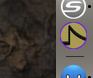
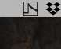
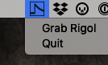
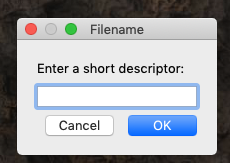
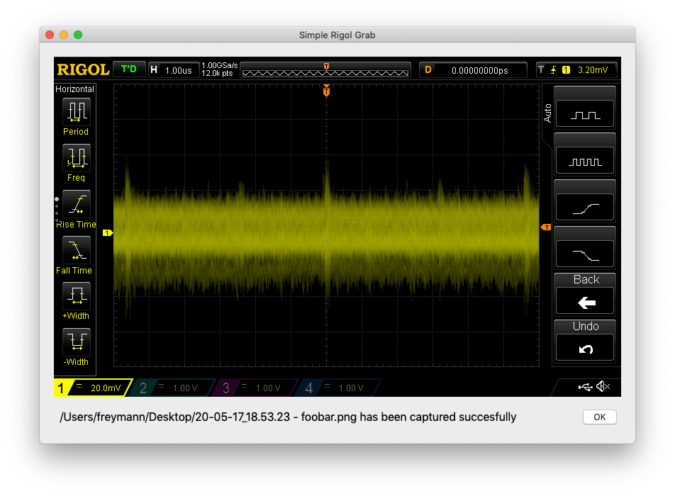

# SimpleRigolGrab
dmf 5.14.20

Persistent menu bar GUI to handle grabbing Rigol screen images at will

Compiles to an OS X app using 'python3 setup.py py2app'.
So this is done for now, pending additional improvements/ideas.

Also runs from the command line 'python3 SimpleRigolGrab'.

## Configuration

* Rigol connected to ethernet with known IP address

* Known IP address and output folder stored in
  
       '~/Library/Application Support/SimpleRigolGrab.json'

## Functionality

python3 simple_rigol_grab.py

* Grab the image from the rigol
* If success,
  * prompt for a filename descriptor, 
  * save a .png image file to disk, and
  * display the image on the screen for 5s  
* If fail,
  * error message popup
* Done

* The goal was to convert this to an app -> _click and done_ -> use py2app -> Works well! 

## In progress

* See comments in code. Should handle missing files, bad formats, etc. To be done. 

## Origin

Development originated from the code for rigol-grab by Robert Poor

rigol_grab: save Rigol Oscilloscope display as a .png file
source: https://github.com/rdpoor/rigol-grab

## Images

App Icon: 

Menubar Icon:

Menubar Menu: 

File Descriptor Popup:

Capture Window: 

